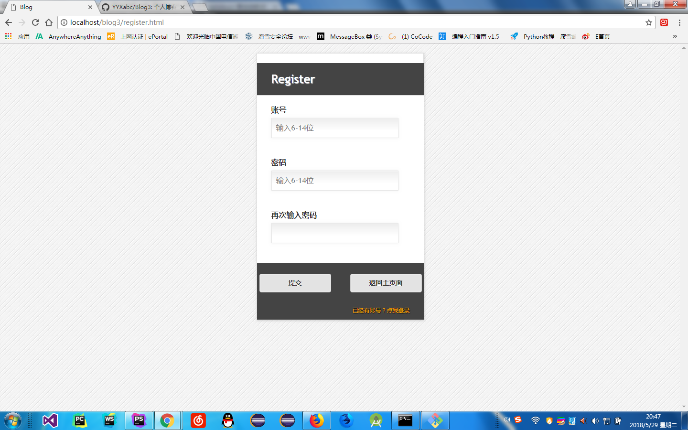

# 个人博客网站/实现在线聊天功能  
### 所用知识 
>前端  
>> HTML,CSS,JavaScript  
>> Websocket  
>> Vue.js  
>> bootstrap  
  
>后端 
>> PHP  
>> Workworkerman  
>> Mysql  
*** 
### 实现功能  
1. 登录功能(login.php)  
  
2. 注册功能(register.html)  
   
